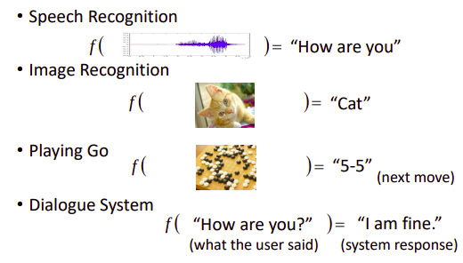
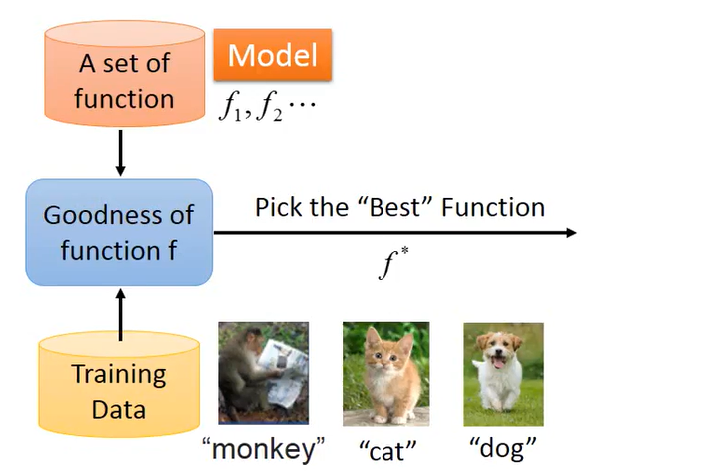
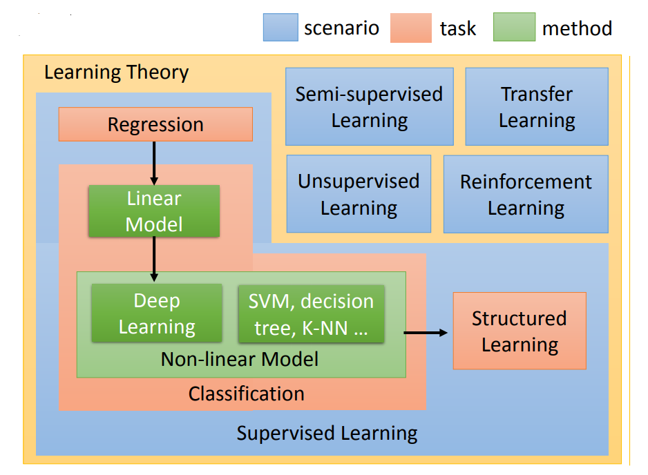

# 机器学习介绍

​	

​	机器学习是什么呢?顾名思义，从名字中可以猜到，就是让机器具有学习的能力。但是机器学习和人工智慧之间又有什么关系呢?人工智慧是我们的目标，而机器学习是我们达成目标的手段，我们希望通过机器学习的方法使得机器可以在某方面跟人一样"聪明"。

​	机器学习方法做的是什么事情呢，从本质上来讲，machine learning	就是自动寻找function。

​	举例来讲，在语音辨识领域，我们想找一个function，它的输入是一个声音信号，它的输出就是语音辨识的文字；在图像识别领域中，输入是一张图片，输出就是图片里有什么东西；下围棋时输入是棋盘，输出就是下一步的动作等等。这些function太过复杂，不是人类可以写出来的，因此我们需要凭借机器的力量，帮我们找出这个function。

​	知道机器学习的任务是找function之后，那我们下面的问题就是如何找到我们需要的function?

​	首先是告诉机器我们需要找什么样的function，是线性的还是非线性的，是一次的还是二次的。也就是给机器一个function set(function集合)，这个function set也就是我们所说的model。

​	第二步，有了function set之后，我们需要告诉机器什么样的function是好的，什么样的是不好的，即给他一些训练资料，告诉机器输入输出长什么样，有什么关系。机器可以根据训练资料判断一个function是好是坏。如果你告诉机器input和output这就叫做supervised learning，之后我们也会讲到其他不同的学习场景。现在机器有办法决定一个function的好坏。但光能够决定一个function的好坏是不够的，因为在你的function set里面，他有成千上万的function，它有会无穷无尽的function，所以我们需要一个有效率的演算法，有效率的演算法可以从function的set里面挑出最好的function。一个一个衡量function的好坏太花时间，实际上做不到。所以我们需要有一个好的演算法，从function set里面挑出一个最好的function。

​	左边这个部分叫training，就是学习的过程；右边这个部分叫做testing，学好以后你就可以拿它做应用。所以在整个machine learning framework整个过程分成了三个步骤。第一个步骤就是找一个function，第二个步骤让machine可以衡量一个function是好还是不好，第三个步骤是让machine有一个自动的方法，有一个好演算法可以挑出最好的function。

# 机器学习相关的技术

## 监督学习

- regression

应用：Stock Market Forecast，Self-driving Car，Recommendation

- Classification
    - Binary Classification
    - Multi-class

## 半监督学习

​	有的时候我们的训练数据的lable没有办法用很自然的方式取得，需要人工的力量把它标注。有没有办法可以减少label需要量呢，在半监督学习中，这些没有label的数据也可能是对学习有帮助的。

## 迁移学习

​	迁移学习的意思是：假设我们要做猫和狗的分类问题，我们也一样，只有少量的有label的data。但是我们现在有大量的data，这些大量的data中可能有label也可能没有label。但是他跟我们现在要考虑的问题是没有什么特别的关系的，我们要分辨的是猫和狗的不同，但是这边有一大堆其他动物的图片还是动画图片（凉宫春日，御坂美琴）你有这一大堆不相干的图片，它到底可以带来什么帮助。这个就是迁移学习要讲的问题。

## 无监督学习

​	在完全没有任何label的情况下，到底机器怎样可以学到一些事情，这是无监督学习中需要解决的问题。

## 监督学习中的结构化学习

​	structured learning 中让机器输出的是要有结构性的，举例来说：在语音辨识里面，机器输入是声音讯号，输出是一个句子。句子是要很多词汇拼凑完成。它是一个有结构性的object。或者是说在机器翻译里面你说一句话，你输入中文希望机器翻成英文，它的输出也是有结构性的。或者你今天要做的是人脸辨识，来给机器看张图片，它会知道说最左边是长门，中间是凉宫春日，右边是宝玖瑠。然后机器要把这些东西标出来，这也是一个structure learning问题。

​	其实多数人可能都听过regression，也听过classification，你可能不见得听过structure learning。很多教科书都直接说，machine learning是两大类的问题，regression，和classification。machine learning只有regression和classification两类问题，就好像告诉你：我们所熟知的世界只有五大洲，但是这只是真实世界的一小部分，真正的世界是如图所示。

​	真正世界还应该包括structure learning，这里面还有很多问题是没有探究的。

## 强化学习

​	在reinforcement learning里面，我们没有告诉机器正确的答案是什么，机器所拥有的只有一个分数，就是他做的好还是不好。
